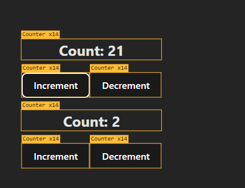
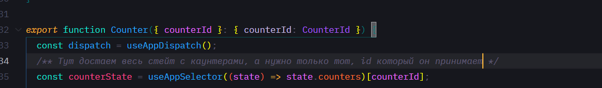
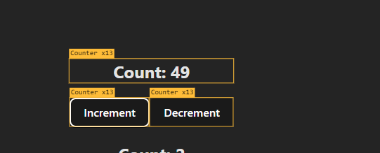
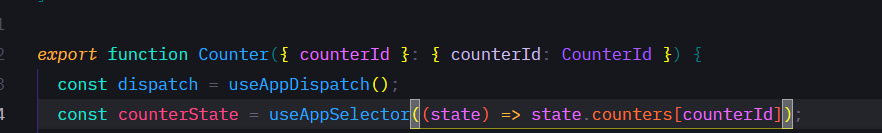
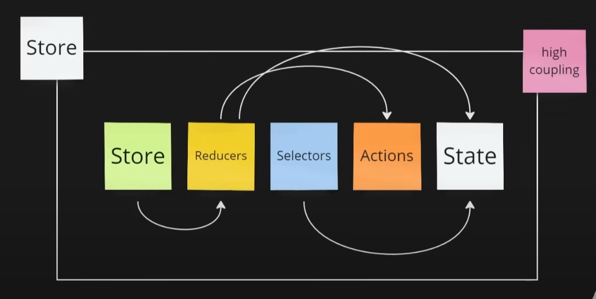
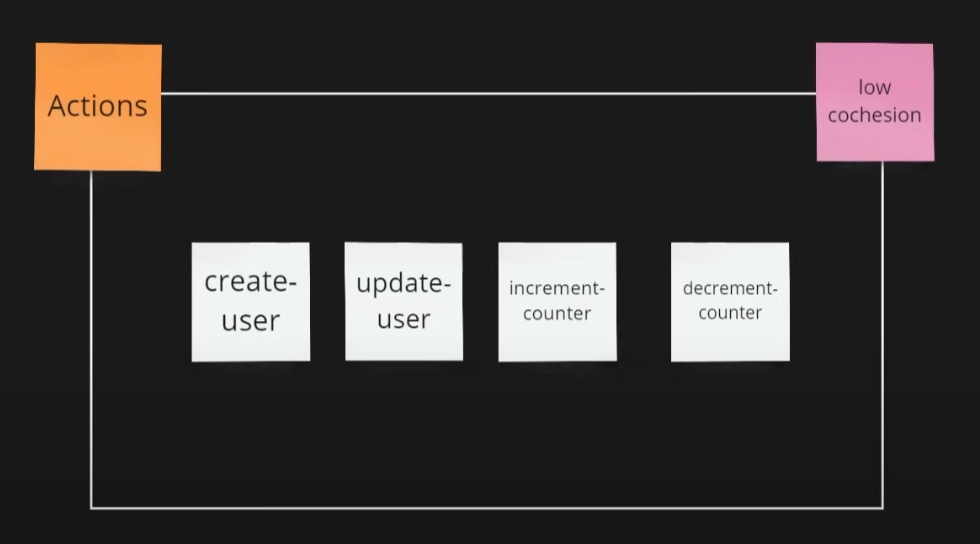
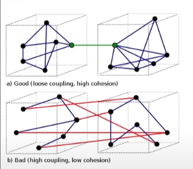

- _"Reducer"_ - чистая функция, которая должна принимать _action_, _предыдущее состояние_
- _"Selector"_ - это чистая функция, которая должна принимать _Redux State_ и возвращает его какой-то _кусочек_

### Зачем нужна иммутабельность

1. Гарантия, что данные не изменятся -> можно сделать например историю изменений
2. Возможные чистые функции
3. Redux использует для оптимизации, react тоже (есть видео у паромова на канале)

### Как Redux оптимизирует Rerender?

По свойству иммутабельности - чтобы определить изменения, достаточно просто сравнить объекты по ссылке

```js
const lastState = {
  counters: {
    first: {
      counter: 10,
      startAt: "2024-05-05",
    },
    second: {
      counter: 12,
      startAt: "2024-05-05",
    },
  },
  someAnotherValue: {
    field: "string",
  },
};

const newState = {
  ...lastState,
  counters: {
    ...lastState.counters,
    second: {
      ...lastState.counters.second,
      counter: 12,
    },
  },
};

/**
 Сравнили ссылки, так как стор имутабелен, проверка очень быстрая - поверхностная по ссылке.
 
 Мы не меняли someAnotherValue, а просто передали ссылку на исходный объект посредством деструктуризации
 
**/
console.log(newState.someAnotherValue === lastState.someAnotherValue); //TRUE

/**
Где-то внутри counters были изменения
**/
console.log(newState.counters === lastState.counters); //false

/**
Тут мы не меняли first, а вернули ссылку (то есть вернули старое значение lastState)
*/
console.log(newState.counters.first === lastState.counters.first); //TRUE

console.log(newState.counters.second === lastState.counters.second); //false
```

## useSelector

Вызывается КАЖДЫЙ раз, когда что-то меняется в ReduxStore, намного чаще, чем ререндерится компонент.

1. Должен возвращать только тот кусок состояния, который нужен компоненту иначе будут перерисовки лишние.
   
   
   
   

### Правила использования селекторов

1. Выбирать как можно меньшие данные по той причине, что если компонент что-то не использует из редакс стора, а это _"что-то"_ часто перерендеривается, то будут лишние перерендеры

2. Желательно иметь сложность O(1) - Для этого часто хранятся данные в структуре Record.

```js

// Bad ❌
const user = useAppSelector(state => state.user.find(user => user.id === userId)) // плохо, лучше оптимизировать - хеш таблица

// Good 🟢
const user = useAppSelector(state => state.users.entities[userId])

type UserState = {
  entities: Record<UserId, User | undefined>
  ids: UserId[]
}
```

Или использовать CreateEntityAdapter - в документации

4. Не создавать новые ссылки в селекторах

```js
// Bad ❌
const sortedUsers = useAppSelector((state) => state.users.toSorted(sortFn));

// Normal 🟡
const users = useAppSelector((state) => state.users);

const sortedUsers = useMemo(() => users.toSorted(sortFn), [users]);
```

Можно использовать Reselect для сложных вычислений или _createSelector_ из пакета redux-toolkit
_createSelector_ - кеширует логику селекторов

```js
// Good 🟢
const selectSortedUsers = createSelector(
  (state) => state.users,
  (users) => users.toSorted(sortedFn)
);

const sortedUSers = useAppSelector(selectSortedUsers);
```

## Разбиение одного большого редюсера на куски

1. _combineReducers_ - служит для объединения редюсеров в один. Когда диспатчится экшн, у нас вызывается КАЖДЫЙ редюсер,
   просто каждый редюсер отвечает за обновление своего кусочка состояния. Поэтому важно в редюсерах иметь _**default**_: в switch case, если action попадет в default, то он будет обработан в обоих редюсерах, но это ничего страшного, так и задумано)

```js
// Как работает combineReducers пример, но под капотом он оптимизирован
const reducer = (state = initialState, action: Action): State => {
  return {
    users: usersReducer(state.users, action),
    counters: countersReducer(state.counters, action),
  };
};

//Good 🟢
const reducer = combineReducers({
  users: usersReducer,
  counters: countersReducer,
});
```

# Разделение Store на модули

Вот примерно так делать не стоит,потому что будет сложно читать если будет много редюсеров и т д.
И еще файлы тесно связаны друг с другом, надо постоянно смотреть в каком файле какая реализация интерфейсов, типов, селекторов и т д

```
store
│─── store.ts
│─── types.ts
│
└─── reducers
│      users.ts
│      counters.ts
│─── actions.ts
│─── selectors.ts
```



**low coupling** - низкая связанность - между модулями должно быть как можно меньше связи
**high cochesion** - высокое зацепление, для того, чтобы модули хорошо читались, они должны быть связаны друг с другом и реализоавывать какую-то одну функциональность



В совокупности мы можем хорошо разделить код на модули.

## Разделение на Slice

Нам нет смысла отделять Action,Reducer,Selectors друг от друга, потому что они плотно друг с другом взаимодействуют (fsd-привет),нужно разделить

Пример разделения, где будет баланс между **coupling** и **cochesion**
users/
│─── users.slice.ts
│─── users-list.tsx
counters/
│─── counters.slice.ts
│─── counters.tsx

# Избавляемся от бойлерплейта в лице @redux/toolkit

Надо как-то избавиться от бойлерплейта, а именно - свич кейсы в редюсерах, постоянное описание типов экшенов, иммутабельные обновления от деструктуризации

На данный момент редюсеры как на примере кода ниже никто не пишет

```
export const usersReducer = (
  state = initialUsersState,
  action: Action
): UsersState => {
  switch (action.type) {
  }
};
```
